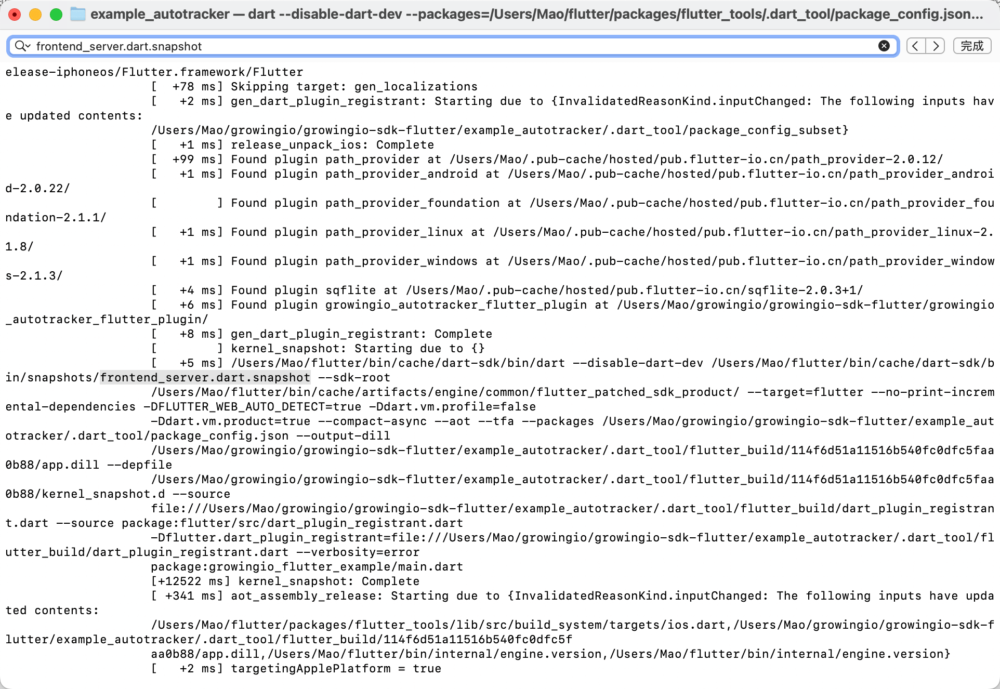
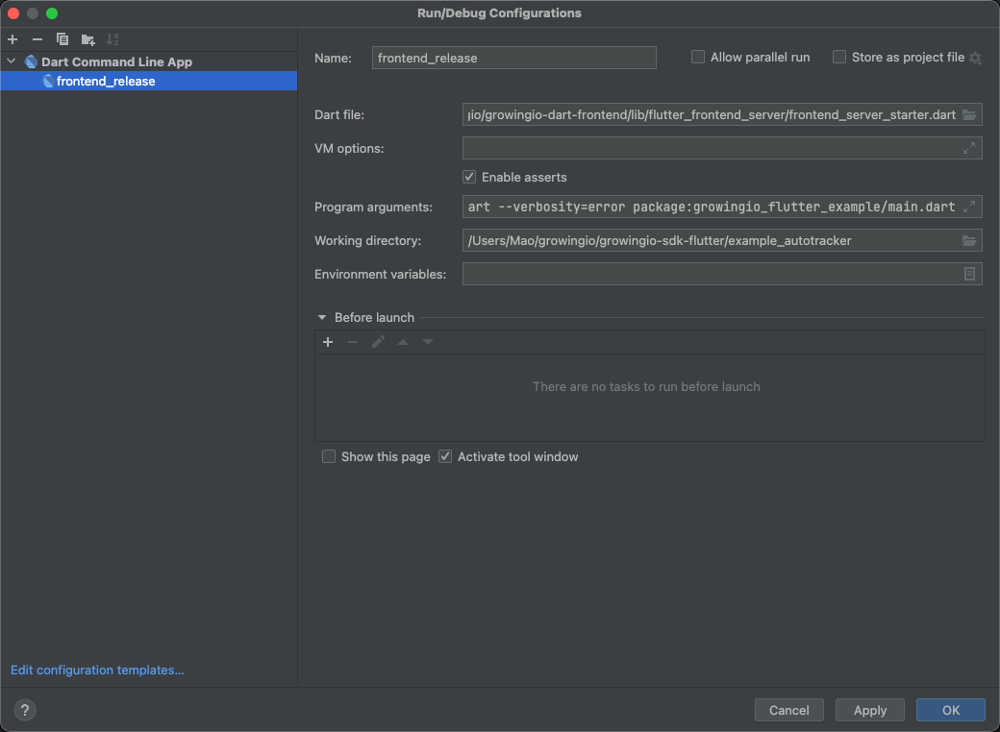

## 如何调试

### 原理

Flutter 在编译工程时，使用位于 `flutter/bin/cache/dart-sdk/bin/snapshots` 目录下的 frontend_server.dart.snapshot，将项目代码编译成 app.dill 文件

### 调试步骤

#### 1. 进入您的工程目录，清除编译缓存

```dart
cd <您的工程目录>
flutter clean
```

#### 2. 获取 frontend_server.dart.snapshot 执行命令

```dart
flutter run -v --release
```

运行成功后，搜索 frontend_server.dart.snapshot



复制并删除 frontend_server.dart.snapshot 路径相关以及 dart 路径相关的命令，得到如下：

```dart
--sdk-root
/Users/Mao/flutter/bin/cache/artifacts/engine/common/flutter_patched_sdk_product/ --target=flutter --no-print-incremental-dependencies -DFLUTTER_WEB_AUTO_DETECT=true -Ddart.vm.profile=false
-Ddart.vm.product=true --compact-async --aot --tfa --packages /Users/Mao/growingio/growingio-sdk-flutter/example_autotracker/.dart_tool/package_config.json --output-dill
/Users/Mao/growingio/growingio-sdk-flutter/example_autotracker/.dart_tool/flutter_build/114f6d51a11516b540fc0dfc5faa0b88/app.dill --depfile
/Users/Mao/growingio/growingio-sdk-flutter/example_autotracker/.dart_tool/flutter_build/114f6d51a11516b540fc0dfc5faa0b88/kernel_snapshot.d --source
file:///Users/Mao/growingio/growingio-sdk-flutter/example_autotracker/.dart_tool/flutter_build/dart_plugin_registrant.dart --source package:flutter/src/dart_plugin_registrant.dart
-Dflutter.dart_plugin_registrant=file:///Users/Mao/growingio/growingio-sdk-flutter/example_autotracker/.dart_tool/flutter_build/dart_plugin_registrant.dart --verbosity=error
package:growingio_flutter_example/main.dart
```

#### 3. 下载 dart 源码

```shell
git clone https://github.com/dart-lang/sdk
```

获取 Flutter version 对应的 Dart version

```shell
flutter --version

Flutter 3.7.0 • channel unknown • unknown source
Framework • revision b06b8b2710 (6 weeks ago) • 2023-01-23 16:55:55 -0800
Engine • revision b24591ed32
Tools • Dart 2.19.0 • DevTools 2.20.1
```

checkout 该 dart version

```shell
git checkout 2.19.0
```

修改 dart 源码中，`sdk/pkg/vm/lib/target/` 目录下 flutter.dart

```dart
import 'package:kernel/transformations/track_widget_constructor_locations.dart';
import 'package:vm/target/vm.dart' show VmTarget;

// 添加以下内容
abstract class FlutterProgramTransformer {
  void transform(Component component);
}
// 添加以上内容

class FlutterTarget extends VmTarget {
  FlutterTarget(TargetFlags flags) : super(flags);

--------------------------------------------------
...省略部分代码
--------------------------------------------------

  @override
  bool get enableSuperMixins => true;
  
// 添加以下内容
  static List<FlutterProgramTransformer> _flutterProgramTransformers = [];
  static List<FlutterProgramTransformer> get flutterProgramTransformers => _flutterProgramTransformers;
// 添加以上内容
  
  // This is the order that bootstrap libraries are loaded according to
  // `runtime/vm/object_store.h`.

--------------------------------------------------
...省略部分代码
--------------------------------------------------

    super.performPreConstantEvaluationTransformations(
        component, coreTypes, libraries, diagnosticReporter,
        logger: logger, changedStructureNotifier: changedStructureNotifier);
// 添加以下内容
    if (_flutterProgramTransformers.length > 0) {
      for (int i = 0; i < _flutterProgramTransformers.length; i++) {
        _flutterProgramTransformers[i].transform(component);
      }
    }
// 添加以上内容
    if (flags.trackWidgetCreation) {
      _widgetTracker.transform(component, libraries, changedStructureNotifier);
    }

--------------------------------------------------
...省略部分代码
--------------------------------------------------
```

修改 `growingio-dart-frontend/pubspec.yaml` 依赖，如下：

```yaml
dependency_overrides:
  package_config: any
  kernel:
    path: /您所下载的 dart 源码目录/sdk/pkg/kernel
  meta:
    path: /您所下载的 dart 源码目录/sdk/pkg/meta
  frontend_server:
    path: /您所下载的 dart 源码目录/sdk/pkg/frontend_server
  front_end:
    path: /您所下载的 dart 源码目录/sdk/pkg/front_end
  dart2js_info:
    path: /您所下载的 dart 源码目录/sdk/pkg/dart2js_info
  dev_compiler:
    path: /您所下载的 dart 源码目录/sdk/pkg/dev_compiler
  _fe_analyzer_shared:
    path: /您所下载的 dart 源码目录/sdk/pkg/_fe_analyzer_shared
  js_shared:
    path: /您所下载的 dart 源码目录/sdk/pkg/js_shared
  build_integration:
    path: /您所下载的 dart 源码目录/sdk/pkg/build_integration
  _js_interop_checks:
    path: /您所下载的 dart 源码目录/sdk/pkg/_js_interop_checks
  compiler:
    path: /您所下载的 dart 源码目录/sdk/pkg/compiler
  js_runtime:
    path: /您所下载的 dart 源码目录/sdk/pkg/js_runtime
  js_ast:
    path: /您所下载的 dart 源码目录/sdk/pkg/js_ast
  vm:
    path: /您所下载的 dart 源码目录/sdk/pkg/vm
```

#### 4. 源码调试 growingio-dart-frontend

##### Android Studio

将本项目拖入 Android Studio，添加 Dart Command Line App



**Dart file** 选择 `growingio-dart-frontend/lib/flutter_frontend_server/frontend_server_starter.dart`

**Program arguments** 填入步骤 2 获取到的命令，无需调整格式，填入后会自动格式化

**Working directory** 选择您的工程

之后就可以在 Debug 下打断点调试 growingio-dart-frontend 的代码了


##### VSCode

launch.json 配置主要是 program 和 args，program 填入 `lib/flutter_frontend_server/frontend_server_starter.dart`，args 填入步骤 2 获取到的命令，需要自行调整格式

示例如下：

```json
{
    "configurations": [
        {
            "name": "Frontend_server",
            "type": "dart",
            "request": "launch",
            "program": "lib/flutter_frontend_server/frontend_server_starter.dart",
            "args": [
                "--sdk-root", 
                "/Users/Mao/flutter/bin/cache/artifacts/engine/common/flutter_patched_sdk_product/", 
                "--target=flutter",
                "--no-print-incremental-dependencies",
                "-DFLUTTER_WEB_AUTO_DETECT=true",
                "-Ddart.vm.profile=false",
                "-Ddart.vm.product=true",
                "--compact-async",
                "--aot",
                "--tfa",
                "--packages",
                "/Users/Mao/growingio/growingio-sdk-flutter/example_autotracker/.dart_tool/package_config.json",
                "--output-dill",
                "/Users/Mao/growingio/growingio-sdk-flutter/example_autotracker/.dart_tool/flutter_build/114f6d51a11516b540fc0dfc5faa0b88/app.dill",
                "--depfile",
                "/Users/Mao/growingio/growingio-sdk-flutter/example_autotracker/.dart_tool/flutter_build/114f6d51a11516b540fc0dfc5faa0b88/kernel_snapshot.d",
                "--source",
                "file:///Users/Mao/growingio/growingio-sdk-flutter/example_autotracker/.dart_tool/flutter_build/dart_plugin_registrant.dart",
                "--source",
                "package:flutter/src/dart_plugin_registrant.dart",
                "-Dflutter.dart_plugin_registrant=file:///Users/Mao/growingio/growingio-sdk-flutter/example_autotracker/.dart_tool/flutter_build/dart_plugin_registrant.dart",
                "--verbosity=error",
                "package:growingio_flutter_example/main.dart"
            ],
        }
    ]
}
```

